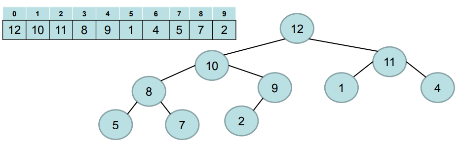

Heap-sort algorithm complexity analysis.

Heap sort algorithm is an in-place method used to implement priority queues and sorting.

Heap sort uses vectors to represents nearly binary trees, an examples is presented in the following image:



A max-heap has the property that the each root has the largest element value in theirs sub-trees. And in contrast, a min-heap has the property that each root has the smallest value in theeris sub-trees. Thus, is considered that

$$A[parent(i)] \geq A[i]$$

Are used the following methods to access left or right child for a given position:

```java
public int left(int i) {
    return (2 * i + 1);
}

public int right(int i) {
    return (2 * i + 2);
}
```