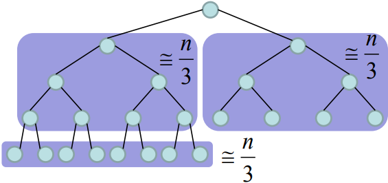
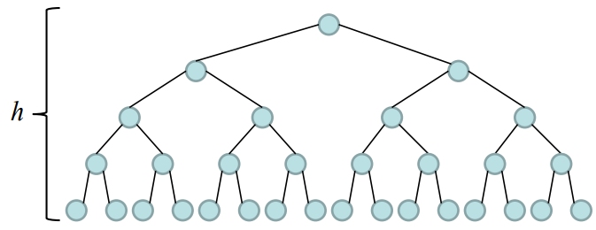

# Heap-sort algorithm complexity analysis.

Heapsort algorithm is an efficient in-place method used to implement priority queues and sorting. Heapsort uses vectors to represents nearly binary trees. An example is presented in the following image:


A max-heap has the property that each root has the largest element value in their subtree. Given by:

$$A[parent(i)] \geq A[i]$$

Where $A$ represents the vector and $i$ the element index. And the parent is defined as:

$$parent(i) = \frac{i}{2}$$

In contrast to max-heap, a min-heap has the property that each root has the smallest value in their sub-tree. Given by:

$$A[parent(i)] \leq A[i]$$

## Left and Right children

Left and Right functions are used to access left or right child for a given position, respectively. The following algorithm describes this functionality.

```java
public int left(int i) {
    return (2 * i + 1);
}

public int right(int i) {
    return (2 * i + 2);
}
```

Analysing the source code, each function requires $O(1)$ time and space complexity.

## Heapify

The heapify function is used to keep the heap property for a given index. The following code describes the functionality:

```java
public void heapify(int a[], int n, int i) {
    int e, d, greatest, aux;
    e = left(i);
    d = right(i);
    if(e < n && a[e] > a[i]) {
        greatest = e;
    } else {
        greatest = i;
    }
    if(d < n && a[d] > a[greatest]) {
        greatest = d;
    }
    if(greatest != i) {
        aux = a[i];
        a[i] = a[greatest];
        a[greatest] = aux;
        heapify(a, n, greatest);
    }
}
```

Analysing the following image:



We can extract the recurrence function that describes the time complexity, given by:

> $$T(n) = T(\frac{2n}{3}) + O(1)$$
> $$T(1) = O(1)$$

Calculating the recurrence pattern:

> $$T(n) = T(\frac{2n}{3}) + 1$$
> $$T(\frac{2n}{3}) = T(\frac{2^2n}{3^2}) + 1$$
> $$T(\frac{2^2n}{3^2}) = T(\frac{2^3n}{2^3}) + 1$$
> $$...$$
> $$T(\frac{2^{h-1}n}{3^{h-1}}) = T(\frac{2^hn}{3^h}) + 1$$

The recurrence stops with:

> $$T(\frac{2^hn}{3^h}) = T(1) = 1$$

And:

> $$\frac{2^hn}{3^h} = 1$$
> $$n = \frac{3^h}{2^h}$$
> $$n = (\frac{3}{2})^h$$
> $$h = \log_{\frac{3}{2}} n$$

Therefore, the time execution for heapify is given by:

> $$T(n) = \log_{\frac{3}{2}} n + 1$$

And the time and space complexity are given by $O(\log n)$.

## BuildHeap

Build heap is used to transform any numeric vector in a heap. The following source code describes this functionality:

```java
public void buildHeap(int a[], int n) {
    int i;
    for(i = n/2; i>=0; i--) {
        heapify(a, n, i);
    }
}
```

A rough analysis drives us to think that the time complexity of heapsort is $O(n \log n)$ due to $n$ calls of heapify. However, we need to take with base the number of nodes related to the heapify function in each level to calculate the complexity.



For example, using the previous image as a reference, we can see that the last node level represents half nodes number without children, so they are no processed (as observed in the buildHeap that ignores half of the vector). After that, for each level up, half of the nodes are processed. Thus the complexity is calculated using the following equation:

Given the heap tree height defined by:

> $$h = \lfloor\log_2 n\rfloor$$

We calculate the complexity by level considering the heapify complexity in each height with the respective nodes numbers. Thus we have:

> $$T(n) = 0\lceil{\frac{x}{2^1}}\rceil + 1\lceil{\frac{x}{2^2}}\rceil + 2\lceil{\frac{x}{2^3}}\rceil + 3\lceil{\frac{x}{2^4}}\rceil + \dots +  + (h-1)\lceil{\frac{x}{2^{(h-1)+1}}}\rceil + h\lceil{\frac{x}{2^{h+1}}}\rceil$$

That can be simplified using a complete binary tree as reference:

> $$T(n) = (h-0)2^0 + (h-1)2^1 + (h-2)2^2 + \dots + 2\times2^{h-2} + 1\times2^{h-1} + 0\times2^h$$

Representing as summation:

> $$T(n) = \sum_{i=0}^{h}{(h-i)2^i}$$

And resolving using perturbation technique:

> $$T(n) = \sum_{i=0}^{h}{(h-i)2^i} = h\sum_{i=0}^{h}{2^i} - \sum_{i=0}^{h}{2^ii}$$

We start solving the first part:

> $$\sum_{i=0}^{h}{2^i} + 2^{h+1} = 2^0 + \sum_{i=0}^{h}{2^{i+1}}$$
> $$\sum_{i=0}^{h}{2^i} + 2^{h+1} = 1 + 2\sum_{i=0}^{h}{2^{i}}$$
> $$\sum_{i=0}^{h}{2^i} = 2^{h+1} - 1$$

And then, resolving the second part:

> $$\sum_{i=0}^{h}{2^ii} + 2^{h+1}(h+1) = 2^0\times0 + \sum_{i=0}^{h}{2^{i+1}(i+1)}$$
> $$\sum_{i=0}^{h}{2^ii} + 2^{h+1}(h+1) = 2\sum_{i=0}^{h}{2^i(i+1)}$$
> $$\sum_{i=0}^{h}{2^ii} + 2^{h+1}(h+1) = 2\sum_{i=0}^{h}{2^ii} + 2\sum_{i=0}^{h}{2^i}$$

Replacing $\sum_{i=0}^{h}{2^i}$ with $2^{h+1} - 1$, we get:

> $$\sum_{i=0}^{h}{2^ii} + 2^{h+1}(h+1) = 2\sum_{i=0}^{h}{2^ii} + 2(2^{h+1} - 1)$$
> $$\sum_{i=0}^{h}{2^ii} = 2^{h+1}(h+1) - 2(2^{h+1} - 1)$$
> $$\sum_{i=0}^{h}{2^ii} = 2^{h+1}(h+1) - 2^{h+2} + 2$$

Finally, replacing the two parts in the original equation, we get:

> $$T(n) = h\sum_{i=0}^{h}{2^i} - \sum_{i=0}^{h}{2^ii}$$
> $$T(n) = h(2^{h+1} - 1) - (2^{h+1}(h+1) - 2^{h+2} + 2)$$
> $$T(n) = h2^{h+1} - h - (h2^{h+1} + 2^{h+1} - 2^{h+2} + 2)$$
> $$T(n) = h2^{h+1} - h - h2^{h+1} - 2^{h+1} + 2^{h+2} - 2$$
> $$T(n) = 2^{h+1}(2-1) - h - 2$$
> $$T(n) = 2^{h+1} - h - 2$$
> $$T(n) = 2^{\lfloor\log_2 n\rfloor+1} - \lfloor\log_2 n\rfloor - 2$$

If we consider that $2^{\lfloor\log_2 n\rfloor}$ represents the leaf nodes parent, and $2^{\lfloor\log_2 n\rfloor + 1}$ the leaf nodes for a heap binary tree representation. We get:

> $$T(n) = 2^{\lfloor\log_2 n\rfloor+1} - \lfloor\log_2 n\rfloor - 2$$
> $$T(n) = n - \log n - 2$$
> $$T(n) = O(n)$$

## Heapsort

The heap sort algorithm with a max-heap works swapping the first vector element with the last and reducing the heap vector size in -1. By this way, in the end of the process, the vector will have the elements in ascendent order. Besides that, every time a swap is made, the heapify function is called for the first element to restore the vector heap property. The heapsort is demonstrated in the following algorithm:

```java
public void heapSort(int a[], int n) {
    int i, aux;
    buildHeap(a, n);
    for(i = n - 1; i > 0; i--) {
        aux = a[i];
        a[i] = a[j];
        a[j] = aux;
        heapify(a, i, 0);
    }
}
```

The time complexity analysis, in this case, considers the buildHeap function, that takes $O(n)$ plus the heapify function, that is called $O(n) \times O(\log n)$. Thus the analysis is calculated as follows:

> $$O(n) + O(n) \times O(\log n)$$
> $$O(n) \times O(\log n)$$
> $$O(n \log n)$$

In this case we conclude that heap sort complexity time is $O(n \log n)$.